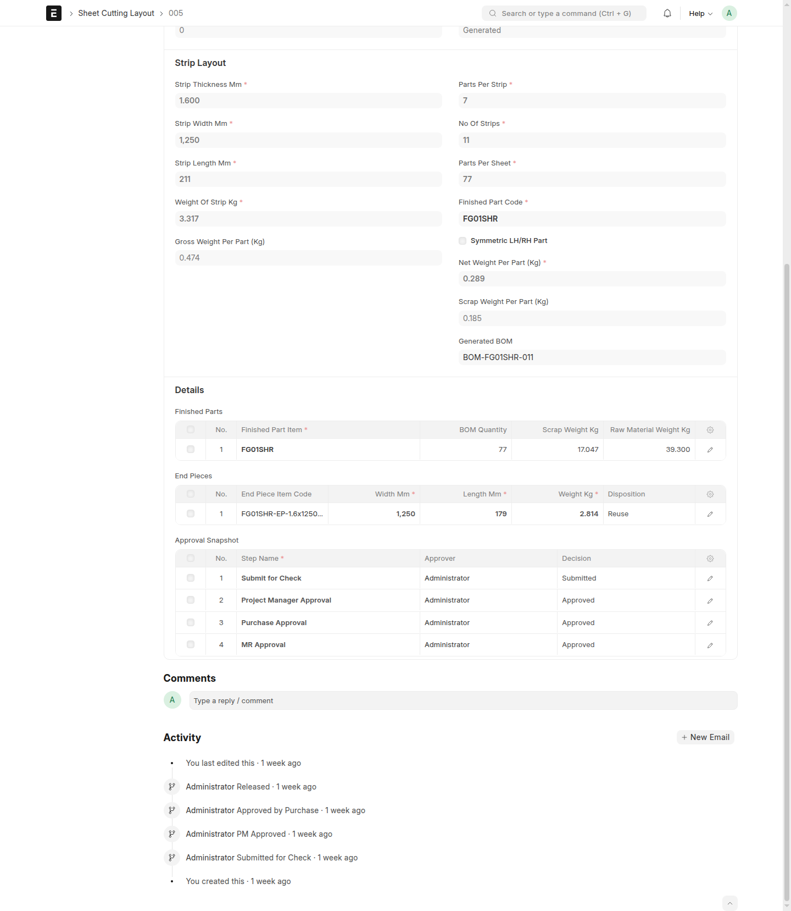

# End Piece BOM Generation

## When To Use This Page

Use this page when end pieces from a layout are meant to be reused instead of treated as scrap. This is especially useful after a layout has already been released and the team wants to create follow-up records for end pieces that still have planned value.

## Before You Begin

Before generating end-piece BOMs, confirm that the layout is already `Released`. This step should be done from the correct released layout, not from an older version, a draft, or a layout that is still waiting for approval.

Also confirm that the end pieces are truly intended for reuse. If the end pieces are not meant to be reused, this step is usually not needed.

On the released layout, look for the end-piece rows that are being kept for future use rather than treated as scrap. In practical terms, users should be able to tell that these rows are intended to remain useful material and should become follow-up records after generation.

## Steps

1. Open the correct released layout.

   Take a moment to confirm the layout status is `Released` and that you are on the exact version the team intends to use. This matters because end-piece BOM generation should follow the approved released record, not an earlier draft or a superseded version.

2. Confirm that the end pieces should be reused.

   Review the layout with the business need in mind. If the end pieces are expected to support future use, then this is the right time to generate the related BOMs from the released layout. Before continuing, make sure the reusable end-piece rows are the ones you expect to carry forward and are not being treated the same way as scrap-only rows.

3. Run end-piece BOM generation from the released layout.

   Use `Generate End Piece BOMs` only after confirming both the layout version and the reuse decision. This keeps the follow-up records tied to the correct released source.

4. Review what appears after generation.

   After the step is complete, expect to see the layout or related records show the generated end-piece BOM results. In practical terms, users should look for new reference details that make it clear the reusable end pieces now have their own follow-up BOM records tied back to the released layout.

5. Check that the generated references match the intended released layout.

   Review the visible references carefully so the team can continue using the correct released source for downstream work, sharing, and traceability.

## What Happens Next

After end-piece BOM generation, users should expect the released layout or its related records to show the generated end-piece BOM references for the reusable end pieces. These references help the team continue work from the correct released layout without guessing which follow-up records belong to which release.

If something looks incorrect, stop before using those results downstream and confirm that the correct released layout was used.

## Common Mistakes

- Running end-piece BOM generation from a layout that is not `Released`.
- Using the wrong released version when more than one layout exists.
- Generating end-piece BOMs before confirming that the end pieces are intended for reuse.
- Assuming the results are correct without reviewing the visible references afterward.
- Continuing downstream work from the wrong layout when the released source was not checked first.

## Screenshots

Use the screenshots to confirm that you are working from the correct `Released` layout before generating anything, and then to verify the visible end-piece BOM references afterward. The key visual checkpoints are the released status, the `Generate End Piece BOMs` action on that released record, and the follow-up references that appear once generation is complete.

- A layout in `Released`
- The `Generate End Piece BOMs` action on a released layout
- A released layout showing generated end-piece BOM references
- A related record view showing the generated end-piece result

