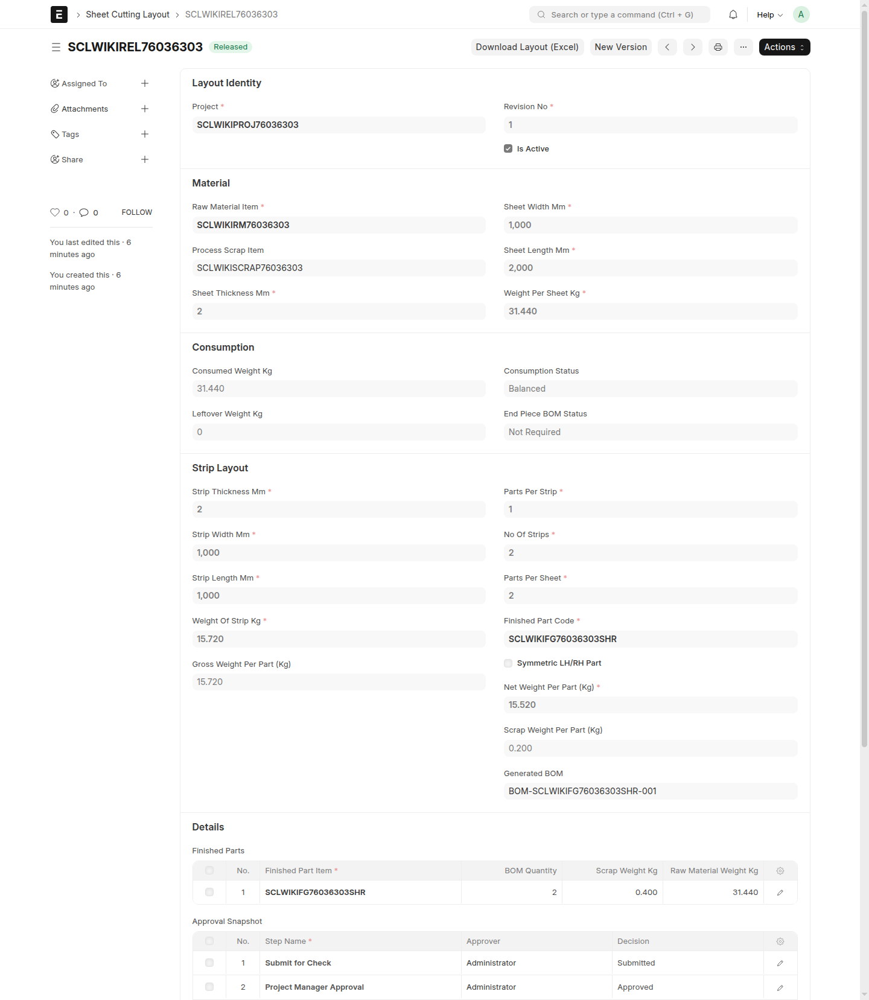

# Revisions and Supersede

## When To Use This Page

Use this page when a released layout needs to be replaced by a newer version. It is for users who need to understand when to use `New Version`, why released layouts should stay controlled, and how an older released layout is retired.

## Before You Begin

Before making changes after release, confirm whether the current layout is already `Released`. If it is, treat that layout as the approved version currently in use. Plan the replacement so the new version can move through review and release before the older one is retired.

The key user-facing states in this process are `Draft`, `Released`, and `Superseded`.

## Steps

1. Use `New Version` when the released layout needs a real change.

   `New Version` is appropriate when the released layout no longer matches the work that should be used going forward. After using `New Version`, expect the replacement to be created as a new `Draft` that carries forward the previous layout details so you can update what changed instead of starting from scratch. You can then continue that draft through the normal approval and release flow. This keeps the replacement clear and allows the new layout to be reviewed and approved properly.

2. Do not edit a `Released` layout directly.

   Users should avoid changing a released layout in place because `Released` means it is the active approved version. Editing it directly can make it harder for other users to understand what was actually approved and what should be used now.

3. Move the replacement layout through the normal workflow.

   Review the carried-forward details in the new `Draft`, update the parts that changed, and make sure the replacement is ready before sending it forward. Then move it through the normal approval path and release it when it is ready. This keeps the version history easy to follow and helps every role work from the correct layout.

4. The `MR Coordinator` uses `Supersede` to retire the older released layout when the replacement is ready.

   `Supersede` is the action used to retire an older released layout once a replacement is ready for use. After `Supersede` is applied, the older layout changes from `Released` to `Superseded`. In practice, this is the step that makes it clear which released layout should no longer be used.

## What Happens Next

After the older layout is marked `Superseded`, users should stop treating it as the active approved version and move forward with the newer released layout instead. The older layout remains part of the record, but day-to-day work should follow the replacement that is now current.

## Common Mistakes

- Editing a `Released` layout directly instead of using `New Version` to start a replacement in `Draft`.
- Using `Supersede` before the replacement layout is actually ready for use.
- Forgetting that `Superseded` means the older released layout has been retired.
- Creating version changes informally, which makes it harder for other users to know which layout is current.

## Screenshots

The screenshots on this page help users distinguish the version-replacement flow, including how to recognize an older `Released` layout, a replacement in `Draft`, and a retired layout in `Superseded`.

- An older layout in `Released`
- A replacement layout being prepared in `Draft`
- The `Supersede` action
- An older layout in `Superseded`

