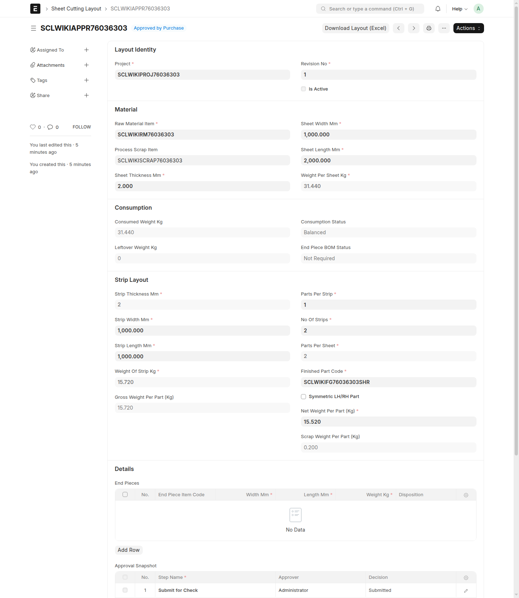
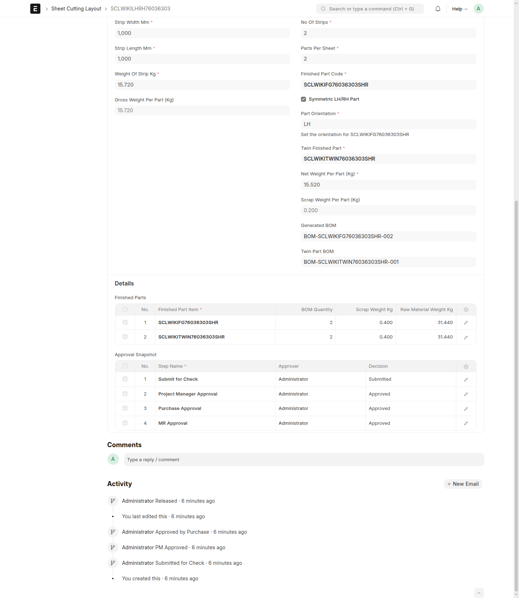

# Troubleshooting

## When To Use This Page

Use this page when a layout is not moving through the workflow as expected or when users are unsure which version, status, or released result they should be using. This page is written for end users who need the next practical step rather than background detail.

## Before You Begin

Before troubleshooting, confirm the current layout status and identify who should act next. The main workflow labels are `Draft`, `Submitted for Check`, `PM Approved`, `Approved by Purchase`, `Released`, and `Superseded`.

Also confirm whether the layout issue is about workflow progress, version selection, or released results such as BOM references. That makes it easier to choose the right next step quickly.

## Steps

### Draft will not move forward

1. Confirm the layout is still in `Draft`.

   If it is in `Draft`, the next normal action is `Submit for Check` by the `Projects User`.

2. Review whether the draft is actually ready for review.

   Make sure the layout is complete enough for the next reviewer. If something still looks unfinished or unclear, correct it before trying again.

3. If needed, ask the right user to perform the next workflow action.

   Only the correct role should move the layout forward at each stage. For the first handoff, that is the `Projects User` using `Submit for Check`.

### Layout returned to `Draft`

1. Recognize that `Reject` sends the layout back to `Draft`.

   This is part of the normal controlled flow. It means the layout needs updates before it goes forward again.

2. Review the feedback from the review step.

   Check what needs to be corrected before resubmitting. Do not send it forward again until those points are addressed.

3. Update the draft and use `Submit for Check` again when ready.

   The `Projects User` should make the needed changes and restart the approval path from `Draft`.

### Layout is approved but not yet active

1. Check whether the layout is `Approved by Purchase` or `Released`.

   A layout in `Approved by Purchase` has finished approval, but it is not yet active for normal downstream use.

2. If it is waiting at `Approved by Purchase`, the `MR Coordinator` should use `MR Release`.

   The layout becomes active only after `MR Release` changes it to `Released`.

3. Tell downstream users to wait for `Released` when they need the final approved record.

   This avoids people using an approved-but-not-yet-active layout as if release is already complete.

### Wrong layout version is being used

1. Compare the available versions before continuing work.

   Look at the status and identify whether the layout in use is `Draft`, `Released`, or `Superseded`.

2. Prefer the current `Released` layout for normal downstream work.

   If a layout is `Superseded`, it should not be treated as the active version anymore.

3. Re-share the correct record if the wrong version has already been circulated.

   This is especially important before export, printing, purchasing, or BOM-related follow-up work.

### Released layout needs a change

1. Do not edit the released record in place.

   A `Released` layout should remain the approved record that users can trust.

2. Use `New Version` to start the change properly.

   This creates the next controlled version in `Draft` so it can move through review and approval again.

3. When the replacement is ready, follow the normal flow and retire the older version with `Supersede`.

   This keeps the record history clear and shows users which released version is current.

### Confusion about BOM references after release

1. Open the correct `Released` layout first.

   Start by confirming you are looking at the correct released record before checking any BOM references.

2. Review the visible BOM references on the released layout.

   These references help users identify the released output tied to that layout.

3. If the layout is an LH/RH pair, expect separate finished-part BOM references for the two sides.

   Make sure users do not assume there will be only one combined finished-part BOM reference.

4. If end pieces were meant to be reused, confirm whether end-piece BOM generation was already run from that released layout.

   This helps explain why some follow-up BOM references may or may not be visible yet.

5. If the expected generated BOM references are not visible after release, pause and confirm that you are looking at the correct released version.

   A common cause is checking an older layout, a draft, or the wrong released record. If the correct released layout is open and the expected references are still missing, stop downstream use until the released result is reviewed by the responsible business user.

### End-piece BOM generation did not complete

1. Confirm that you started from the correct `Released` layout.

   End-piece BOM generation should be run from the released record that the team intends to use, not from an earlier version.

2. Review the end-piece rows again before retrying.

   Make sure the end pieces you expect to carry forward are clearly the reusable ones on that released layout and are not being treated as scrap.

3. Check whether any generated end-piece references appeared only partially.

   If some expected results are still missing, do not assume the step finished correctly. Stop and review the released layout carefully before trying to continue downstream work.

4. If needed, ask the responsible business user to review the released layout before trying again.

   This is the safest next step when the generation result is incomplete or unclear.

### Export or download did not behave as expected

1. Confirm that you opened the correct layout before using `Download Layout (Excel)`.

   Many export problems come from starting on the wrong version, especially when both current and older layouts are available.

2. Try `Download Layout (Excel)` again from the layout you want.

   Make sure you are using the action from the exact record you intend to share or print.

3. Check the downloaded workbook before sending it on.

   If the file content does not match the layout you expected, return to the layout list, open the correct record, and export again.

4. If no usable workbook is produced, stop and keep others from using an uncertain file.

   It is better to retry from the correct layout than to circulate a workbook that may represent the wrong version.

## What Happens Next

After identifying the issue, users should continue from the correct workflow step, version, or released record. In most cases, the next action is to correct the draft, use the proper workflow action, switch to the correct `Released` version, or start a controlled revision with `New Version`.

If the problem still remains after those checks, gather the layout name, current status, and the exact action you were trying to take so the responsible business user can review the situation quickly.

## Common Mistakes

- Treating `Approved by Purchase` as if it means the layout is already active.
- Forgetting that `Reject` returns the layout to `Draft`.
- Continuing to use a `Superseded` layout after a newer version is available.
- Trying to change a `Released` layout directly instead of using `New Version`.
- Expecting one combined BOM reference for an LH/RH release instead of separate finished-part references for each side.
- Checking BOM references on the wrong version of the layout.

## Screenshots

Use the screenshots to match what you see on screen with the correct next action. Focus on the visible status first, then confirm whether the layout is still in review, already `Released`, already `Superseded`, or showing released BOM references that need to be checked more closely.

- A layout in `Draft`
- A layout returned to `Draft` after `Reject`
- A layout in `Approved by Purchase`
- A layout in `Released`
- A layout in `Superseded`
- A released LH/RH layout showing separate finished-part BOM references

