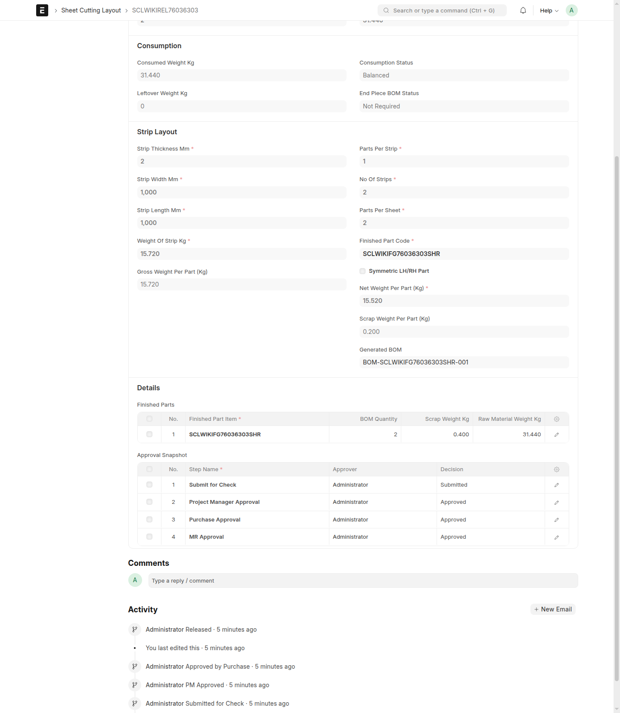

# Typical Workflow

## When To Use This Page

Use this page when you want a clear picture of the normal journey of a sheet cutting layout from first draft to final release. It is especially useful for new team members, cross-functional handoffs, and anyone who wants to understand which role acts at each stage.

## Before You Begin

Before starting the workflow, make sure the layout information you plan to enter is ready and has been checked by the person creating the draft. It also helps to know which team member will act next after your step, because the layout moves through several approval stages before release.

The normal status path is:

`Draft` -> `Submitted for Check` -> `PM Approved` -> `Approved by Purchase` -> `Released`

If a released layout is later retired, its final user-facing state becomes `Superseded`.

## Steps

1. A `Projects User` creates the layout and saves it in `Draft`.

   In this stage, the layout is still being prepared. The `Projects User` can review the details, make corrections, and confirm everything is ready before sending it forward.

2. The `Projects User` uses `Submit for Check`.

   This moves the layout from `Draft` to `Submitted for Check`. At this point, the layout is ready for review by the `Projects Manager`.

3. The `Projects Manager` reviews the submitted layout and uses `Project Manager Approves`.

   When approved, the status becomes `PM Approved`. This shows that the project-side review is complete and the layout is ready for the purchase-side approval.

4. The `Purchase Manager` reviews the layout and uses `Purchase Approves`.

   This changes the status to `Approved by Purchase`. The layout has now completed the approval stages and is ready for release by the `MR Coordinator`.

5. The `MR Coordinator` performs `MR Release`.

   This moves the layout to `Released`. After release, the layout becomes the active approved version for use.

6. The `MR Coordinator` uses `Supersede` when a released layout must be retired.

   `Supersede` is the user-facing action for retiring a released layout. Once this is done, the layout moves to `Superseded`, and the newer version should be used going forward.

## What Happens Next

After a layout reaches `Released`, the team should treat it as a controlled record. Day-to-day work should continue from that released version until a business change requires a replacement.

When a change is needed after release, the recommended process is to create a new version, move that new version through the same approval flow, and then use `Supersede` on the older released layout when it should no longer be used.

## Common Mistakes

- Submitting too early before the draft has been fully reviewed by the `Projects User`.
- Assuming `PM Approved` means the layout is already released. It still needs purchase approval and release.
- Using `Supersede` too early before the replacement layout is ready for use.
- Forgetting that each role acts at a different stage, so the next step may depend on another user taking over.

## Screenshots

This page shows the main workflow checkpoints so you can quickly recognize where a layout is in the process.

- A draft layout in `Draft`
- A layout in `Submitted for Check`
- A layout in `PM Approved`
- A layout in `Approved by Purchase`
- A released layout in `Released`
- A retired layout in `Superseded`

